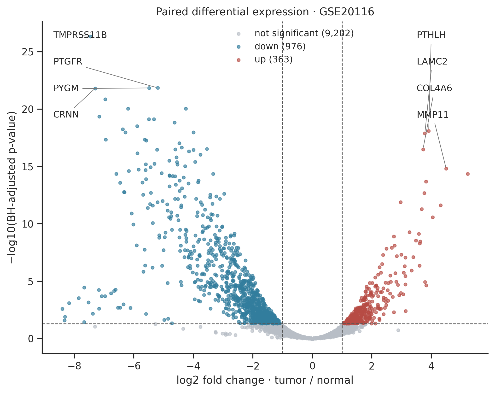

# Transcriptomic Profiling of Oral Squamous Cell Carcinoma

> **Dataset layout update:** The statistics and original report below describe the preserved GSE20116 discovery snapshot. New discovery runs write to `results/GSE20116/`; independent validation writes to `results/GSE184616/` and `VALIDATION_REPORT.md`. The original `REPORT.md`, `results/tables/`, and `results/figures/` are retained unchanged. See [setup and validation instructions](docs/SETUP_AND_VALIDATION.md). External validation always uses the original discovery snapshot, not a later rerun.

A complete Python research portfolio investigating **which gene representatives and pathways differ between OSCC and matched normal oral tissue**. It combines an auditable public-data reanalysis, paired negative-binomial modeling, publication figures, a research report, and an interactive Streamlit explorer.

**Real data, not demonstration measurements:** the analysis retains **GSE20116**, with six RNA-seq samples from three matched patients. It uses raw count columns from the original publication's supplementary Table S1. It does not use the related microarray experiment or treat normalized expression as counts.



The representative volcano uses computed paired-model results. Positive log2 fold change means tumor relative to normal. See [figure captions](results/figures/CAPTIONS.md) for selection rules and [REPORT.md](REPORT.md) for interpretation.

## Verified analysis snapshot

| Measure | Result at q < 0.05 and absolute log2 fold change > 1 |
|---|---:|
| Matched patients / samples | 3 / 6 |
| Source RefSeq transcripts | 15,668 |
| Retained gene representatives | 10,541 |
| Eligible finite gene tests | 10,506 |
| Upregulated representatives | 363 |
| Downregulated representatives | 976 |
| Features excluded for an optimizer convergence failure | 35 |

Leading upregulated representatives include **PTHLH, LAMC2 and COL4A6**; leading downregulated representatives include **TMPRSS11B, PTGFR and PYGM**, ranked within direction by adjusted p-value. Hallmark GSEA places **E2F Targets** toward positive tumor/normal statistics (NES 2.61) and **Myogenesis** toward negative statistics (NES −2.57). Both have permutation FDR estimates of zero at 1,000 permutations, which indicates finite resolution, not certainty. These are exploratory associations in three patients, not validated biomarkers or evidence of pathway activation. The [complete results](results/tables/differential_expression.csv) and [pathway tables](results/tables/gsea.csv) are the source of these statements.

## Dataset decision

The actual GEO SOFT file identifies **GSM515513–GSM515518**, patients **8, 33 and 51**, and AB SOLiD System 3.0 data aligned to hg18. The GEO supplement is a roughly 3.9 GB MAX-alignment archive, not a gene-count matrix. However, [Tuch et al. (2010)](https://doi.org/10.1371/journal.pone.0009317) supplied a small expression workbook, also documented in the [edgeR user guide's oral-carcinoma case study](https://www.bioconductor.org/packages/devel/bioc/vignettes/edgeR/inst/doc/edgeRUsersGuide.pdf).

Inspection confirmed that **Excel columns D–I contain raw integer sums**, whereas J–O contain normalized values. This project reads only the raw columns, selects one representative transcript per unambiguous source symbol, and computes new statistics. The input is approximately 7.3 MiB plus small metadata and Hallmark files. **No alternative dataset was substituted.** This is a publication-derived, gene-representative count matrix; it is not newly reprocessed sequencing or modern gene-union counts.

See [data/PROVENANCE.md](data/PROVENANCE.md) for accession mappings, source URLs, exact processing rules, checksum locks, source licensing and download instructions.

## Installation

Use **Python 3.11** (verified with 3.11.13). The project intentionally limits Python compatibility while the scientific environment is pinned. Run commands from the repository root.

```bash
python -m venv .venv
# Linux/macOS:
source .venv/bin/activate
# Windows PowerShell instead:
# .venv\Scripts\Activate.ps1
python -m pip install -r requirements.txt
python -m pip install --no-deps -e .
```

`requirements.txt` pins direct dependencies. [requirements-lock.txt](requirements-lock.txt) records the full verified Windows environment; use it instead of requirements.txt for tighter transitive pinning. Other operating systems may need additional platform-specific dependencies. The supplied GitHub Actions workflow runs synthetic tests on Linux; its remote execution has not been verified here.

If activation is restricted on Windows, use `.venv\Scripts\python.exe` and `.venv\Scripts\oscc.exe` directly. This workspace already contains an ignored local Python 3.11 environment. It is not part of the Git repository.

## Reproduce the entire analysis

```bash
oscc run
```

This downloads checksum-locked sources if necessary, validates metadata/counts, constructs gene representatives, filters low expression, fits the paired model, computes Hallmark enrichment, creates PNG/SVG figures and CSV tables, and writes the report and provenance manifest. Expected runtime is a few minutes on a typical laptop after installation; no multi-gigabyte downloads or R installation are required. Internet access is required only for uncached sources. Requests have timeouts and a 30 MB per-file limit.

```bash
oscc download                          # Cache the publication workbook and GEO SOFT
oscc run --offline                     # Requires cached workbook, SOFT and GMT for enrichment
oscc validate                          # Check completed output hashes and data alignment
oscc run --alpha 0.01 --lfc 1.5         # Recompute selections, enrichment, figures and report
oscc run --permutations 10000           # Higher GSEA permutation resolution
oscc run --libraries MSigDB_Hallmark_2020 GO_Biological_Process_2023 Reactome_2022
```

`python -m oscc.cli run` is equivalent to `oscc run`. All options are listed by `oscc --help`. Defaults are 10 reads in at least three samples, q < 0.05, |LFC| > 1, seed 42, 1,000 permutations and one CPU. The completed snapshot uses **Hallmark only**; optional GO/Reactome branches have not been run against real data here. Additional libraries can take longer and are exploratory, with separate within-library corrections.

The output manifest marks a run `running`, `failed`, or `complete`; the dashboard refuses incomplete runs or changed/missing output files. Source checksum changes require deliberate inspection, not automatic acceptance. If a gene-set source is unavailable, gene analysis still completes and enrichment is explicitly marked unavailable; no pathway results are invented. An interrupted run can be restarted with the same command. Do not run two writers concurrently in the same output directory.

## Launch the dashboard

```bash
streamlit run app/streamlit_app.py
```

Open the local URL printed by Streamlit (normally `http://localhost:8501`). The app loads the included real-result bundle without downloading raw data. It includes provenance and cohort metrics, interactive volcano thresholds, searchable/sortable gene tables, patient-matched gene expression, a top-gene heatmap, GSEA/ORA exploration and CSV downloads. Cache invalidation includes file modification times and sizes; output hashes are verified when loading.

Dashboard sliders **filter gene results only**. The pathway panel displays the thresholds used for the saved enrichment; rerun the pipeline to change those analyses. Zero and missing adjusted p-values are handled without filling them with invented values.

## Methods and interpretation

1. Parse sample identities from GEO SOFT; require one normal and one tumor per patient, unique samples/features, numeric finite nonnegative integer counts, and exact sample alignment.
2. Convert the source RefSeq annotation to gene-symbol representatives by maximum exon count and lexical RefSeq tie-breaking, independently of fold changes. Reject ambiguous/missing symbols; record every decision. Never sum overlapping transcripts. Apply the abundance filter to the already prefiltered publication universe.
3. Fit PyDESeq2 with `~ patient_id + condition`, tumor/normal contrast and median-of-ratios normalization. Check model rank, residual degrees of freedom and gene-wise/MAP/LFC convergence. Disable count replacement; enable Cook filtering. Exclude failed fits before BH correction. Independent filtering is disabled so the tested family is explicit.
4. Save raw, size-factor-normalized, and log2(normalized + 1) expression separately. The log transform is for visualization, not count modeling or a claimed VST. PCA uses the most variable genes without DE selection; the DE heatmap is descriptive and not independent confirmation.
5. Use exact source-symbol matching to human GMT sets. ORA uses separate up/down lists with at least five genes and the actual tested background; all eligible sets, including zero-overlap sets, enter BH. GSEApy preranking uses signed Wald statistics. Sets require 15–500 tested members. Save mapping coverage, contributing genes, statistics and gene-set checksums.

**Important limits:** three patients provide only two residual degrees of freedom; PyDESeq2 explicitly warns about dispersion uncertainty. Historical SOLiD/hg18 processing, prefiltering and old symbols limit coverage. Tumor heterogeneity, muscle/immune/stromal composition and normal-margin field effects can explain expression differences. LFCs are unshrunk; Wald inference is approximate. Gene-set permutations do not fully model gene correlation. Agreement with the original paper is same-cohort agreement, not validation. No clinical prediction, external validation, qPCR or causal experiment was performed.

## Repository guide

```text
app/streamlit_app.py          interactive research explorer
data/raw/                    ignored original downloads and cached GMTs
data/processed/              regenerated counts and metadata
src/oscc/
  acquisition.py             bounded downloads, SHA256, workbook/SOFT parsers
  validation.py              matrices, matching and design identifiability
  preprocessing.py           gene representatives and filtering
  differential.py            paired PyDESeq2, convergence audit and BH
  enrichment.py              GMT parsing, tested-background ORA and GSEApy
  visualization.py           consistent PNG/SVG figures and captions
  dashboard.py               validated and testable data-loading logic
  pipeline.py, cli.py         one-command orchestration
  report.py                  research report from computed outputs
notebooks/01_oscc_analysis.ipynb
results/figures/              eight figure types in PNG and SVG, captions
results/tables/               complete DE, expression, QC, mapping and pathway CSVs
results/manifest.json         source/output hashes, settings, versions and status
tests/fixtures/               clearly labeled synthetic fixtures for tests only
scripts/                     notebook execution and dashboard smoke checks
REPORT.md                    generated research-style report
docs/VERIFICATION.md         actual executed checks and remaining limits
```

Large raw data, environments, tools, credentials and caches are ignored. Modest derived tables and figures are included so the project is reviewable and the dashboard can open without network access. See [the output data dictionary](results/tables/README.md).

## Tests and walkthrough

```bash
python -m pytest -q
python -m pip check
python scripts/execute_notebook.py
python scripts/check_dashboard.py
```

Pytest covers pairing, metadata alignment, invalid expression matrices, filtering, transcript selection, model fold-change direction, BH correction, enrichment input/background preparation, dashboard integrity checks, and plots when no genes pass thresholds. Synthetic counts are restricted to tests. Notebook execution and dashboard smoke checks require the generated real outputs. Execution details, including the tests actually run, are recorded in [docs/VERIFICATION.md](docs/VERIFICATION.md).

## Resume bullets

- Implemented and verified a reproducible Python reanalysis of six GSE20116 RNA-seq libraries, using paired PyDESeq2 models, convergence auditing and BH correction across 10,541 gene representatives.
- Built a Streamlit/Plotly research dashboard, Hallmark GSEA and tested-background enrichment analysis, publication-style figures, an executable notebook and automated validation tests with auditable data provenance.

## References and license

[Tuch et al., 2010](https://doi.org/10.1371/journal.pone.0009317) · [GEO GSE20116](https://www.ncbi.nlm.nih.gov/geo/query/acc.cgi?acc=GSE20116) · [DESeq2](https://doi.org/10.1186/s13059-014-0550-8) · [PyDESeq2](https://doi.org/10.1093/bioinformatics/btad547) · [GSEApy](https://doi.org/10.1093/bioinformatics/btac757) · [Hallmark gene sets](https://doi.org/10.1016/j.cels.2015.12.004).

Project code is [MIT licensed](LICENSE). Original data and gene-set definitions retain their source licenses and attribution requirements. This repository has been initialized locally; publishing to a GitHub account is a separate action.
