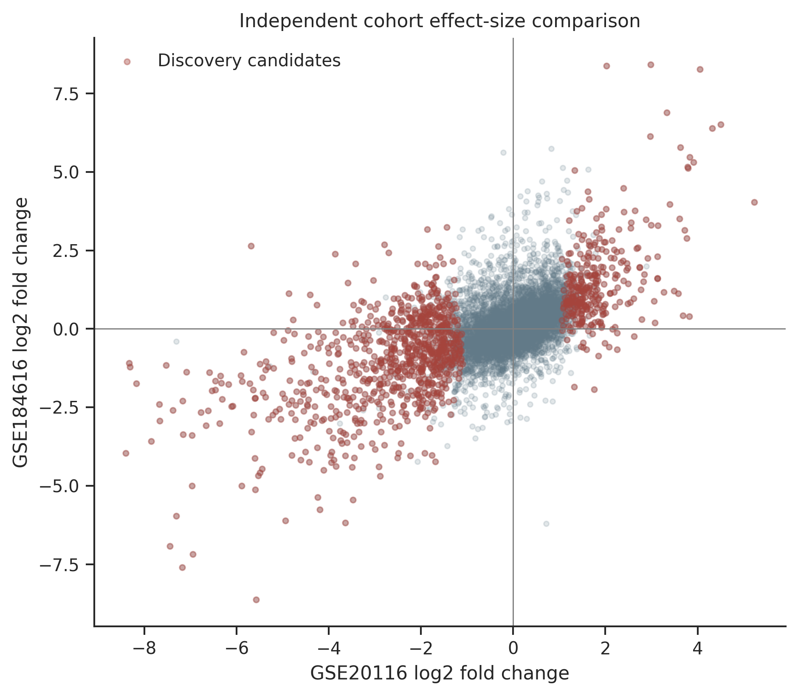
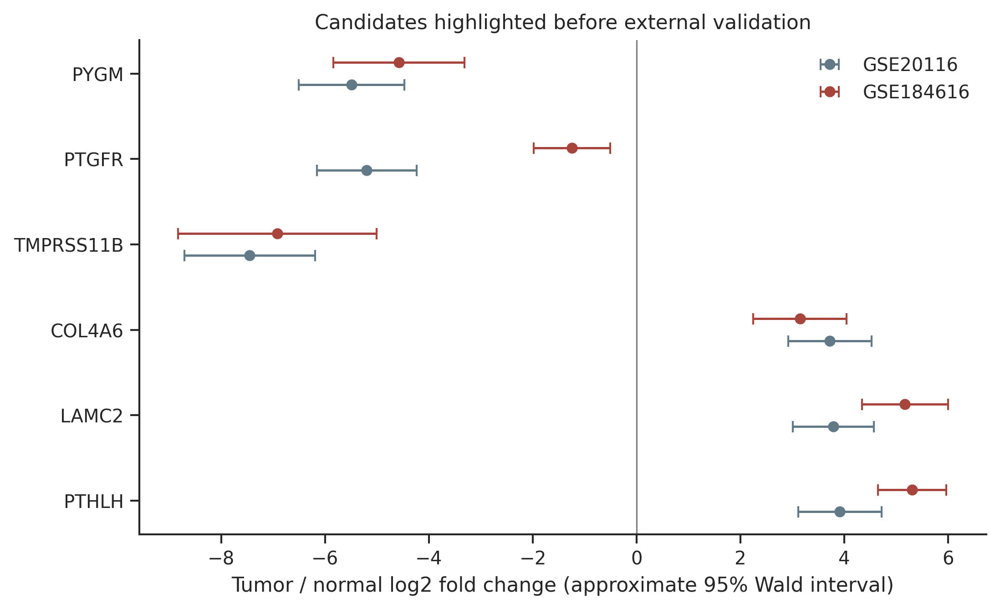
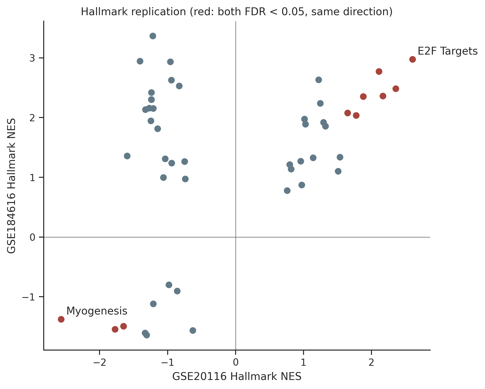
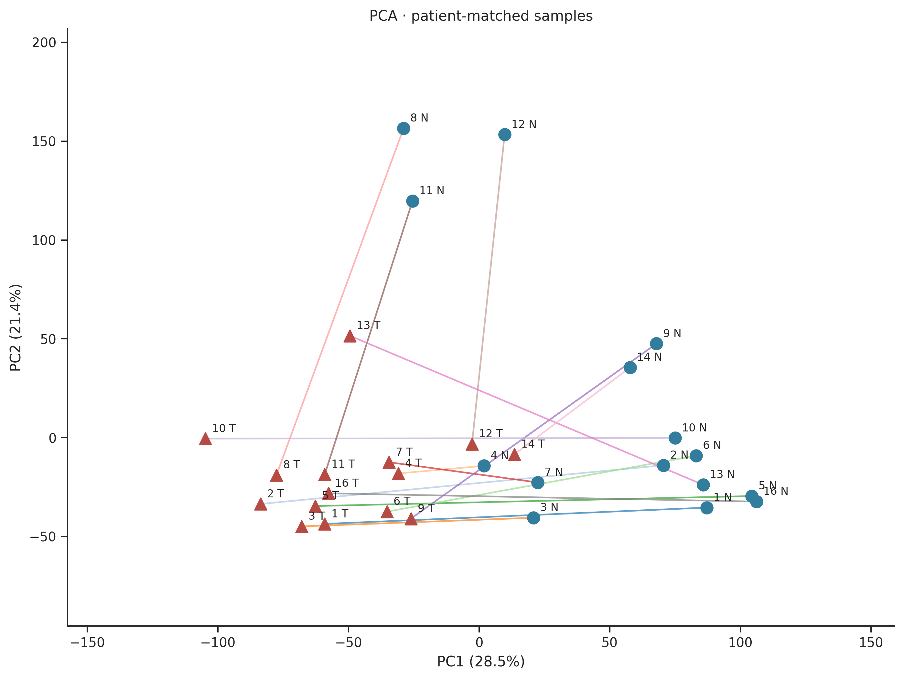
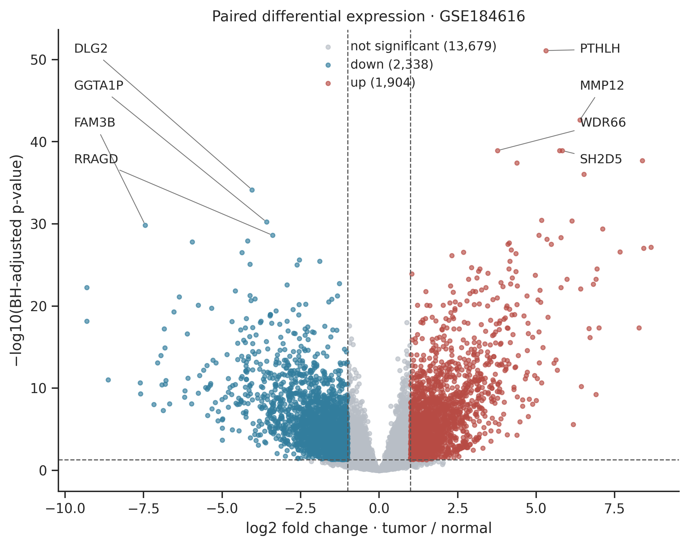

# Independent OSCC validation: GSE184616

## Execution and scope
The independent analysis completed using real deposited counts. GSE20116 remains the discovery cohort and GSE184616 is the external validation cohort. No sample pooling or joint normalization was performed. The original REPORT.md, discovery tables, figures, processed data and manifest were checked by SHA256 before and after validation and remained unchanged.

This is replication of differential-expression associations, not validation of a diagnostic classifier, prognosis model, causal mechanism or clinical biomarker. Sample accessions do not overlap. Separate studies, institutions and collection periods support cohort independence; individual identities cannot be audited from public anonymized records.

## Verified source and cohort
Source: [GEO GSE184616](https://www.ncbi.nlm.nih.gov/geo/query/acc.cgi?acc=GSE184616), not a versioned accession ending in `.1`. We inspected `GSE184616_unnormalisedGeneCounts.txt.gz` and `GSE184616_family.soft.gz`. The deposited FPKM file was not used for count modeling. The count matrix has 59,050 unique gene-symbol rows and 30 samples, with finite, nonnegative integer values and exact GEO-title-to-count-column alignment. No rounding, imputation, or duplicate summation was needed.

The 15 matched patients have IDs OSCC_1 through OSCC_14 and OSCC_16; no OSCC_15 is deposited. Each has one adjacent-normal oral mucosa and one primary tumor. The metadata-derived age range is 21–50 years; 9 male and 6 female patients. All samples were retained. Sites are heterogeneous:

| Anatomic site | Pairs |
| --- | --- |
| Tongue | 11 |
| Floor of mouth | 2 |
| Gingivolingual sulcus | 1 |
| Palatal mucosa to maxilla | 1 |

The series describes an HPV-negative cohort. Sample GSM5593760 (OSCC_7-P) gives only “Oral Squamous Cell Carcinoma” in its diagnosis field, while its normal counterpart explicitly says HPV-negative. The sample-level omission is retained as “not stated in sample”, not silently imputed. Age, sex, smoking and site agree within every pair. Patient blocking absorbs patient-level covariates; they are not added as collinear fixed effects.

GEO describes NovaSeq 6000, hg38, STAR 2.7.2 and GENCODE 31. The raw count file records strand-specific read-pair counts; RSEM-derived FPKMs are a separate resource. Raw sequencing/alignment quality was not recomputed. [Sample processing record](https://www.ncbi.nlm.nih.gov/geo/query/acc.cgi?acc=GSM5593748).

| File | SHA256 | Bytes |
| --- | --- | --- |
| GSE184616_unnormalisedGeneCounts.txt.gz | 5d9e406952eb5c64e87774b336d5ed58fffca2fe83ead513e485df4e6c071451 | 1608300 |
| GSE184616_family.soft.gz | 31111ea040a0c3324c73ba4be2438d6c663e05922f204be359f2d768a6eb108c | 3866 |

## Analysis fixed before validation model fitting
Discovery candidates were frozen from the original saved discovery results using their saved thresholds (BH q < 0.05, absolute log2 fold change > 1.0). The 1,339-gene candidate list and its checksum were saved before fitting the validation model. This is a retrospective external validation plan, not a prospectively registered study.

For validation, an abundance-only rule requires at least 10 reads in at least 15 of 30 samples, fixed at the size of one condition group without using DE outcomes. 17,921 genes passed. PyDESeq2 0.5.2 fits `~ patient_id + condition` with tumor/normal contrast, median-of-ratios normalization, no count replacement, Cook filtering, and no independent filtering. Design rank: 16; residual degrees of freedom: 14. 71 genes failed at least one optimizer convergence check. 17,850 genes have finite eligible p-values; BH correction is across these validation tests, not just selected candidates. Model warnings are preserved in the manifest and diagnostics file.

Primary gene replication requires a frozen discovery candidate, the same effect direction, and validation genome-wide BH q < 0.05. A stricter descriptive count additionally requires validation absolute log2 fold change > 1. The Wald null is zero effect; the effect-size cutoff is not a formal test against a twofold-change boundary. No thresholds were tuned to maximize replication.

## Identifier coverage and candidate concordance
Both deposited tables already use gene symbols. Mapping is exact and case-sensitive, with no speculative alias conversion. Historical RefSeq representatives in GSE20116 are compared with modern gene-level counts in GSE184616; these are different quantification units. Unmatched, filtered, or failed-test genes remain visible in the candidate table and are not counted as evidence of biological non-replication.

| Mapping / expression status | Count |
| --- | --- |
| matched_exact_symbol | 1193 |
| not_in_validation_source | 123 |
| filtered_low_expression | 23 |

Of 1,339 frozen candidates, 1,187 were testable and 964 had concordant signs (81.2% of testable candidates). **706 replicated** under the primary criterion; **563** also exceeded absolute validation log2 fold change 1.

| Outcome | Count |
| --- | --- |
| replicated | 706 |
| not_significant | 420 |
| not_testable | 152 |
| significant_opposite_direction | 61 |

The following six candidates were highlighted in the original discovery README before external validation; they are displayed regardless of validation outcome:

| gene | discovery_log2FoldChange | validation_log2FoldChange | validation_padj | validation_outcome |
| --- | --- | --- | --- | --- |
| PTHLH | 3.914 | 5.308 | 7.979e-52 | replicated |
| LAMC2 | 3.787 | 5.168 | 3.751e-31 | replicated |
| COL4A6 | 3.723 | 3.145 | 1.483e-10 | replicated |
| TMPRSS11B | -7.451 | -6.919 | 3.876e-11 | replicated |
| PTGFR | -5.199 | -1.247 | 0.002844 | replicated |
| PYGM | -5.49 | -4.578 | 3.491e-11 | replicated |

Across all 8,982 mutually testable genes, the descriptive Spearman correlation between discovery and validation log2 fold changes is **0.5243**. This is not a classification accuracy or a formal test of equality of effects. The effect comparison table contains both standard errors and the difference between cohort estimates.

Validation-wide DE calls (q < 0.05 and absolute LFC > 1): 1,904 upregulated and 2,338 downregulated genes. These are distinct from candidate replication counts.

Intervals are approximate unshrunk 95% Wald intervals. Discovery selection creates winner's-curse bias, and cross-platform differences limit literal equality of effect sizes.

## Pathway replication
Both analyses use the same checksum-locked human MSigDB_Hallmark_2020 definitions. Validation GSEA uses all finite, convergence-qualified signed Wald statistics, 1,000 gene-set permutations, seed 42, and 15–500 tested members per set. A pathway replicates when it has discovery and validation GSEA FDR < 0.05 and the same NES sign. This criterion refers to permutation-derived within-library FDR, not gene-level BH.

Of 13 discovery-significant pathways, 13 were testable in both cohorts and **10 replicated**. Every discovery-significant term is shown, including discordant and nonsignificant terms:

| Term | discovery_NES | validation_NES | discovery_padj | validation_padj | replicated |
| --- | --- | --- | --- | --- | --- |
| E2F Targets | 2.605 | 2.974 | 0 | 0 | True |
| G2-M Checkpoint | 2.111 | 2.77 | 0 | 0 | True |
| Myc Targets V1 | 2.358 | 2.482 | 0 | 0 | True |
| Myogenesis | -2.565 | -1.378 | 0 | 0.04159 | True |
| mTORC1 Signaling | 2.169 | 2.36 | 0 | 0 | True |
| Myc Targets V2 | 1.88 | 2.351 | 0.00132 | 0 | True |
| Glycolysis | 1.775 | 2.034 | 0.003299 | 7.658e-05 | True |
| Adipogenesis | -1.773 | -1.545 | 0.003941 | 0.01279 | True |
| Unfolded Protein Response | 1.65 | 2.076 | 0.01225 | 8.061e-05 | True |
| KRAS Signaling Dn | -1.648 | -1.494 | 0.01861 | 0.01573 | True |
| UV Response Dn | -1.594 | 1.356 | 0.02594 | 0.0565 | False |
| Cholesterol Homeostasis | 1.537 | 1.336 | 0.02804 | 0.06476 | False |
| Estrogen Response Late | 1.51 | 1.1 | 0.03152 | 0.293 | False |

Background gene coverage differs between cohorts; NES values are not measurements on an identical scale. This comparison does not restrict both analyses to an identical common gene universe. Gene-set permutations do not fully model gene correlation, overlapping pathways are dependent, and zero FDR estimates reflect finite permutation resolution. Separate up/down ORA tables are exploratory supporting outputs, not the primary pathway replication criterion. Enrichment direction is not evidence of pathway activation or inhibition.

## Quality-control figures

PCA uses the most variable genes without DE selection. The saved DE heatmap and top-gene patient trajectories are descriptive and selected from validation DE results; they are not independent confirmation of those same results. The fixed six-gene comparison above uses discovery-selected candidates. All PNG figures also have SVG counterparts.

## Limitations
GSE20116 has only three patients and two residual degrees of freedom; its selected effects may be unstable. Legacy SOLiD/hg18 RefSeq-representative counts and prefiltering differ from NovaSeq/hg38 gene-level quantification. Exact symbol matching misses renamed genes. The 15-patient external series covers several oral subsites and an age-restricted, series-described HPV-negative population, limiting generalization. Bulk tissue composition, muscle content, stromal/immune admixture, tumor purity and normal-margin field effects can drive concordant signals without tumor-intrinsic regulation. No purity adjustment, anatomic-subsite sensitivity analysis, survival analysis, qPCR or perturbation experiments were performed. Patient-level clinical characteristics cannot remove condition-confounded technical effects. Replication supports associations in this external cohort, not clinical deployment.

## Reproduction and outputs
Run `.venv/Scripts/python.exe -m oscc.cli external-validation --offline` after source caching, or omit `--offline` to acquire checksum-locked missing inputs. Validation settings are fixed except seed and permutation count. Use `python -m oscc.cli validate --dataset GSE184616` for output-integrity and alignment checks. Do not run concurrent writers for the same dataset.

The original discovery snapshot remains under `results/tables`, `results/figures`, and `REPORT.md`. New discovery reruns write to `results/GSE20116`; external validation writes to `results/GSE184616` and this report. The comparison always reads the frozen original discovery snapshot, even if a newer discovery rerun exists.

- [Validation manifest](results/GSE184616/manifest.json): source/output hashes, frozen candidate hash, software versions, warnings and original-snapshot checks.
- [Candidate concordance](results/GSE184616/tables/candidate_concordance.csv): all frozen candidates, coverage and outcomes.
- [All discovery gene comparisons](results/GSE184616/tables/gene_concordance.csv).
- [Pathway replication](results/GSE184616/tables/pathway_replication.csv).
- [Validation differential expression](results/GSE184616/tables/differential_expression.csv).
- [Verified sample metadata](results/GSE184616/tables/metadata.csv).

Study reference: [Satgunaseelan et al., 2021, Oral Squamous Cell Carcinoma in Young Patients Show Higher Rates of EGFR Amplification](https://doi.org/10.3389/fonc.2021.750852).
